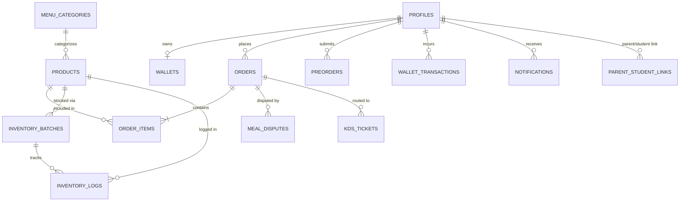

# NovaLunch Enterprise Master System & Flow Specification (`SYSTEM_SPEC.md`)
> **Saint Joseph College of Novaliches, Inc. (SJC)**  
> **Master Consolidated Specification: Architecture, Product Scope, Visual Design System, 2-Tap Kiosk State Machine, Role Flows, Schemas, & Account Registry**  
> *Single Source of Truth for Autonomous Agentic Development & Engineering Operations*

---

## 📑 Table of Contents
1. [Executive Summary & System Architecture](#1-executive-summary--system-architecture)
2. [Quick Start & Operations Guide](#2-quick-start--operations-guide)
3. [Product Scope, Personas & Operating Context](#3-product-scope-personas--operating-context)
4. [Visual Design System & UI Specifications](#4-visual-design-system--ui-specifications)
5. [Identified Documentation Mismatches & Ground Truth](#5-identified-documentation-mismatches--ground-truth)
6. [Roles & Permissions Matrix (RBAC & Security Audit)](#6-roles--permissions-matrix-rbac--security-audit)
7. [Step-by-Step User Role Flows](#7-step-by-step-user-role-flows)
8. [Hardened 2-Tap Kiosk Checkout Flow (Edge AI Engine)](#8-hardened-2-tap-kiosk-checkout-flow-edge-ai-engine)
9. [Database Schemas, FIFO Stock Logs & RPC Procedures](#9-database-schemas-fifo-stock-logs--rpc-procedures)
10. [Authentication & Verified Account Registry](#10-authentication--verified-account-registry)

---

## 1. Executive Summary & System Architecture

NovaLunch is an enterprise-grade institutional canteen ecosystem built for Saint Joseph College of Novaliches. It unifies physical computer vision hardware terminals, 125kHz RFID card authentication, and an iOS Light Glassmorphism single-page application (SPA) backed by Supabase PostgreSQL.

```
                           +-------------------------------------------------------------+
                           |                    SUPABASE CLOUD POSTGRESQL                |
                           |   (Profiles, Wallets, Inventory, Orders, Batches, Policies) |
                           +------------------------------+------------------------------+
                                                          ^
                                                          | REST / RPC / Realtime WebSocket
                                                          v
+-------------------------------+              +----------+--------------------+              +-------------------------------+
|     PHYSICAL EDGE KIOSK       |  HTTP / SSE  |    UNIFIED WEB PORTAL SPA     |  Local HTTP  |     LOCAL BRIDGE SERVER       |
| (student_kiosk_gui.py : 8085) | <----------> |  (unified_web_portal.html)    | <----------> |        (server.py : 8080)     |
| - Pygame / OpenCV Camera HUD  |              | - Student / Parent Portals    |              | - Web Asset Static Server     |
| - YOLO Tray Object Detection  |              | - POS Cashier & KDS Terminal  |              | - 1-Click GUI Subprocess Spawn|
| - Hardware RFID Keyboard Hook |              | - Admin Governance & SIS Sync |              | - Process Status Watchdog     |
| - SQLite Buffer (novalunch_edge)             | - SWR Multi-Tier LocalStorage |              +-------------------------------+
+-------------------------------+              +-------------------------------+
```

### 1.1 Architectural Composition

| Layer | Technology Stack | Key Files & Artifacts | Primary Responsibility |
|---|---|---|---|
| **Frontend Web Portal** | Vanilla HTML5, React 18 (UMD Standalone), Babel Browser Transpiler, Tailwind CSS (JIT via CDN), Lucide Icons, jsPDF & AutoTable | `src/portals/unified_web_portal.html`<br>`index.html`<br>`src/portals/index.html` | Multi-role SPA containing Student, Parent, Cashier POS, KDS, and Admin dashboards with client-side routing. |
| **Backend & Local Bridge** | Python 3.9+ `http.server` (Multi-threaded BaseHTTPRequestHandler, socketserver `ThreadingMixIn`) | `server.py`<br>`src/hardware/student_kiosk_gui.py` | Serves web assets on Port 8080, manages Kiosk GUI subprocess spawning, and provides SSE/REST bridge on Port 8085. |
| **Database & Cloud Layer** | PostgreSQL 15 via Supabase, PostgREST API, Supabase JS v2 Client Library | `src/services/supabaseClient.js`<br>`src/database/ALL_IN_ONE_MIGRATION_SAFE.sql`<br>`src/database/final_governance_patch.sql` | Relational storage for user profiles, wallets, transactions, inventory batches, FIFO stock logs, dispute tickets, and system governance settings. |
| **Edge Hardware & AI Engine** | Python 3, Pygame, OpenCV (`cv2`), Ultralytics YOLOv8 (`novalunch_yolo.pt`), SQLite3 (`novalunch_edge.db`) | `src/hardware/student_kiosk_gui.py`<br>`src/ai_engine/inspect_yolo_model.py`<br>`src/assets/models/novalunch_yolo.pt` | Real-time overhead tray image capture, object detection inference, RFID keyboard wedge listener, customer-facing display (CFD), offline SQLite transaction buffer, and auto-sync daemon. |
| **State Management & Caching** | React Hooks (`useState`, `useEffect`, `useMemo`, `useRef`), Browser `localStorage` persistence layer, In-Memory TTL Cache (`CanteenCache` / SWR) | `src/services/supabaseClient.js`<br>`src/portals/unified_web_portal.html` | Client-side reactive state synchronized bidirectionally with `localStorage` keys (`novalunch_*`) and background cloud fetch fallbacks. |

### 1.2 Network Ports & Service Endpoints

- **Port 8080 (`server.py`)**: Local web server.
  - `GET /` -> Serves `src/portals/unified_web_portal.html`.
  - `GET /api/kiosk/status` -> Checks if Port 8085 is listening.
  - `POST /api/launch_kiosk` / `POST /api/kiosk/launch` -> Spawns `student_kiosk_gui.py` subprocess.
- **Port 8085 (`student_kiosk_gui.py`)**: Edge Hardware & CFD Kiosk REST / SSE Server.
  - `GET /api/kiosk/status` -> Live kiosk state (`IDLE`, `SCANNING`, `SETTLEMENT`, active student, cart, total).
  - `GET /api/kiosk/events` -> Server-Sent Events (SSE) stream pushing real-time hardware state transitions to web POS.
  - `GET /api/camera/stream` -> MJPEG video stream from overhead tray webcam.
  - `GET /api/camera/frame.jpg` & `/api/camera/frame_annotated.jpg` -> Single-frame JPEG tray snapshots.
  - `POST /api/kiosk/sync` -> Action dispatcher from Web POS (`reset`, `scan`, `pay`, `pay_later`, `update_cart`, `confirm_payment`, `complete_checkout`).
  - `POST /api/cache_offline` & `POST /api/offline_sync` -> Offline cache synchronization.

---

## 2. Quick Start & Operations Guide

### 2.1 Environment Setup
```bash
# 1. Clone & create environment file
cp .env.example .env

# 2. Install Python dependencies
pip install -r requirements.txt
```

### 2.2 Launching the Web Portal & Bridge Server
```bash
# Start the unified local server (Port 8080)
python3 server.py
```
Open `http://localhost:8080` in any modern web browser.

### 2.3 Launching the Physical Kiosk & AI Vision
```bash
# Start Customer-Facing Display (CFD) Kiosk GUI (Port 8085)
python3 src/hardware/student_kiosk_gui.py
```

### 2.4 Inspecting Trained YOLO Weights
```bash
python3 src/ai_engine/inspect_yolo_model.py src/assets/models/novalunch_yolo.pt
```

---

## 3. Product Scope, Personas & Operating Context

### 3.1 Target Personas
1. **Students**: View live menus, check e-wallet balance, pre-order for recess/lunch breaks, generate dynamic QR codes, request SOS top-ups, dispute incorrect charges, and checkout via 2-tap RFID.
2. **Parents**: Monitor student nutrition, set daily/weekly spending caps, configure allergen guardrails, reload wallets via GCash receipts, and download monthly PDF statements.
3. **Cashiers**: Operate the POS terminal, synchronize with AI tray scans, lookup RFID cards, apply institutional discounts, process split payments, dispatch KDS tickets, and perform Shift Z-Read cash reconciliations.
4. **Administrators**: Manage menu catalogs, track FIFO inventory batches and spoilage, provision user accounts, approve GCash reloads, resolve meal disputes, export SIS tuition billing batches, and configure global governance policies.
5. **Faculty / Staff**: Campus employees with meal purchases billed to accumulated payroll salary deduction.

### 3.2 Operating Principles
- **Zero-Friction Speed**: Sub-second checkout latency via automated RFID and YOLO computer vision.
- **Data Integrity**: Atomic balance deductions with strict parent-controlled daily spending limits.
- **Hardware Resiliency**: Keyboard-wedge RFID normalization with offline SQLite transaction queueing (`novalunch_edge.db`).
- **Privacy Masking**: Overhead camera captures are tightly cropped around the tray platform, discarding student face data.

---

## 4. Visual Design System & UI Specifications (Apple HIG × Anti-AI-Slop)

> Master UI/UX Reference: See full specification at [`DESIGN_SYSTEM.md`](file:///Users/louiseadrianvnonog/PROJMAN/Website-canteen/DESIGN_SYSTEM.md) and workspace rule at [`.agents/rules/ui-ux-design-system.md`](file:///Users/louiseadrianvnonog/PROJMAN/Website-canteen/.agents/rules/ui-ux-design-system.md).

### 4.1 Executive Philosophy & The 4 Laws of Anti-AI-Slop Visual Hygiene
1. **Strict Zero-Emoji Policy [CRITICAL]**:
   - Raw Unicode emojis (`🍱`, `⚡`, `🎉`, `🗑`, `⚠️`, `💡`, `📍`, `👋`, `💳`, etc.) are **strictly prohibited** across all production portal markup, headers, navigation items, toasts, banners, badges, empty states, and table cells.
   - All visual semantics must use standardized Lucide SVG vector components (`Icon.Utensils`, `Icon.MapPin`, `Icon.Package`, `Icon.AlertTriangle`, `Icon.CheckCircle2`, `Icon.Info`, `Icon.XCircle`, `Icon.Clock`, `Icon.DollarSign`, `Icon.Users`, `Icon.ShieldCheck`, `Icon.Activity`, `Icon.CreditCard`, `Icon.QrCode`, etc.) at optical sizes (`12px`, `14px`, `16px`, `20px`) with fixed `strokeWidth={2}`.
2. **Confident Copywriting (Elimination of Explanatory Clutter)**:
   - Interfaces must not narrate their own operations. Remove repetitive subtitles, parenthetical helpers (*"Click here to..."*, *"Please note that..."*), and defensive legalistic blurbs under action headers.
   - Use active verbs (`Reload`, `Transfer`, `Export`, `Claim`) and single-word status badges (`Active`, `Cleared`, `Locked`, `Pending`).
3. **Eradication of Browser & Platform Artifacts**:
   - Strip native number input spinners (`appearance: textfield; -webkit-appearance: none;`).
   - Implement Apple-standard brand focus rings: `outline: none; box-shadow: 0 0 0 2px var(--color-canvas), 0 0 0 4px var(--color-accent-subtle); border-color: var(--color-brand-primary);`.
4. **Surface-First Hierarchy Over Drop-Shadow Stacking**:
   - Ban arbitrary heavy CSS drop shadows (`box-shadow: 0 20px 25px -5px rgba(0,0,0,0.1)`).
   - Express elevation through tinted translucent materials, subtle hairline borders (`1px solid rgba(0, 0, 0, 0.08)` or `rgba(255, 255, 255, 0.12)`), and surface contrast (Base `#F8FAFC` vs Surface `#FFFFFF`).

### 4.2 Dmitry Sergushkin's 11 Sidebar Masterclass Heuristics
1. **Content Prioritization**: Single-line concise route labels without collapse tricks that obscure daily work.
2. **Quick Search**: Native search field (`bg-slate-200/60 dark:bg-slate-800/60 rounded-xl px-3 py-1.5`) below app identifier with instant filtering.
3. **Identity Capsule**: iOS-style identity card pinned with avatar, name, org, and `ChevronsUpDown` account switcher.
4. **Subtle Hierarchy & Tracking**: Section divider labels styled with uppercase micro-tracking: `text-[10px] font-bold text-slate-400 uppercase tracking-widest px-3 py-1`.
5. **System Vitality Indicator**: Dedicated telemetry pill (*"Terminal Online • Node SJC-01"*).
6. **Single Active Focus**: Calm, tinted pill selection (`bg-brand-50 text-brand-700 font-semibold rounded-xl`).
7. **Calibrated Badges**: Numeric pills truncate cleanly (`9+`, `99+`) with accent status dot and tabular numerals (`font-variant-numeric: tabular-nums`).
8. **Adaptive Fluid Collapse**: Full labels on desktop; tablet icon-only dock rail with instant hover tooltips (`offset-x: 8px`).
9. **Predictable Grouping**: Grouped logically into Operational, Administrative, and Configuration modules.
10. **Keyboard Ergonomics**: Global hotkeys (`⌘1`, `⌘2`, `⌘K`) mapped with typographic glyph tags.
11. **Minimalist Action Bar**: Clean bottom edge with hairline border and single-stroke SVG vector icons (`Icon.LogOut`).

### 4.3 Apple HIG Core System Tokens & Architecture
- **Typography Scale**: Display Large (34pt / -0.4px tracking), Title 1 (28pt / -0.3px), Title 2 (22pt / -0.2px), Title 3 (20pt / -0.15px), Headline/Body (17pt / -0.4px), Callout (16pt / -0.3px), Subheadline (15pt / -0.2px), Footnote (13pt / -0.1px), Caption 1 (12pt / 0px), Caption 2 (11pt / +0.1px), Micro/Overline (10pt / +0.6px uppercase).
  - *Font Pairing*: **Outfit** / SF Pro Display for hero numbers, balances, and prominent titles; **Inter** / SF Pro Text for functional metadata and lists.
- **Spatial Grid & Hit Target**: All interactive touchpoints must maintain a minimum `44 × 44 pt` bounding box. Layout offsets strictly follow the 8pt structural grid (`4px`, `8px`, `16px`, `24px`, `32px`, `48px`, `64px`).
- **Continuous Squircle Geometry**: Modal/Sheet shells (`rounded-3xl` / 24-28px), Content cards (`rounded-2xl` / 16-20px), Inputs/Settings rows (`rounded-xl` / 12-14px), CTAs/Badges (`rounded-full` / 9999px).
- **Materials & Translucency**:
  - Canvas Underlay: `#F8FAFC` (Slate Canvas light) / `#090D16` (dark).
  - Frosted Glass: `rgba(255, 255, 255, 0.85); backdrop-filter: blur(20px) saturate(180%); border: 1px solid rgba(226, 232, 240, 0.8);`.
  - Brand Primary: `#7B1E22` (SJC Crimson), Brand Hover: `#631418`.

### 4.4 Component-Level Design Architecture
- **Pattern A (Wallet-Style Transaction Cell)**: Ban raw data tables for consumer/student logs. Display transactions as Apple Wallet visual cells (`40 × 40 px` rounded-2xl icon square + bold title / muted subline + tabular-nums right-aligned amount with muted chevron).
- **Pattern B (Apple Health Progress & Biometric Tile)**: 8px rounded-full gradient progress track + side-by-side metric sub-cards + uppercase overline tags.
- **Pattern C (iOS Grouped Settings Cell)**: Unified `rounded-2xl` container with hairline inner dividers indented past the icon (`ml-14`) and genuine iOS toggle switches (`w-12 h-7`).
- **Pattern D (Dynamic Floating Action Pill)**: Translucent, centered floating pill (`bottom-6 inset-x-0 mx-auto w-[92%] max-w-lg`) with item counter badge, subtotal, and tactile brand button.

### 4.5 Micro-Interactions, Spring Dynamics & Self-Auditor
- **Spring Physics**: Modals (Mass 1.0, Stiffness 300, Damping 30), Buttons (Mass 0.5, Stiffness 400, Damping 25), Toggles (Mass 0.8, Stiffness 350, Damping 28).
- **Tap Feedback**: `.interactive-tap:active { transform: scale(0.97); filter: brightness(0.96); }`.
- **Pre-Flight AI Checklist**:
  1. Zero raw emojis?
  2. 44pt minimum touch target?
  3. Confident, concise copywriting?
  4. Spring tap feedback (`active:scale-[0.97]`)?
  5. Smooth squircle geometry (16-24px)?
  6. Frosted vibrancy with hairline border?
  7. Tabular numerals for financial amounts?
  8. Apple Wallet list cells instead of raw data tables?

---

## 5. Identified Documentation Mismatches & Ground Truth

| Domain | Historical File Conflict | Active Ground Truth (This Specification) |
|---|---|---|
| **Design Aesthetic** | `PRODUCT.md` stated *"dark glassmorphism"*, while `DESIGN.md` and active UI specify *"Light Glassmorphism"*. | **Institutional iOS Light Glassmorphism**: Light slate canvas (`#F8FAFC`), translucent white frosted glass surfaces (`rgba(255, 255, 255, 0.85)`), and SJC Crimson (`#7B1E22`). |
| **Kiosk Checkout Flow** | Early prototypes used legacy single-tap / passive tray scanning. | **Hardened 2-Tap Authorized AI Flow**: Tap 1 (ID & Arm) ➔ Camera HUD Opens & Food Placed ➔ YOLO Scan ➔ Summary & Diff Watchdog ➔ Tap 2 (Verify & Deduct). |
| **RFID Badge Formats** | `AUTHENTICATION_CREDENTIALS.md` used mock hex strings (`9A-4F-21-C8`), while hardware logs use 10-digit EM4100 decimals (`0009401737`). | **Dual Normalization**: System normalizes both 10-digit decimal badge numbers and hex strings to resolve user profiles. |
| **Data Resiliency** | `README.md` noted SQLite edge storage, while web portal uses `localStorage` cache. | **Tiered Persistence**: Web portal uses `localStorage` SWR multi-tier cache; physical kiosks use SQLite `novalunch_edge.db` for offline queueing. |
| **Manager PIN Override** | Hardcoded `'1234'` in early scripts vs dynamic JSON in `canteen_settings`. | **Dynamic Governance**: Loaded from Supabase `canteen_settings.manager_void_pin.pin` with `'1234'` fallback. |

---

## 6. Roles & Permissions Matrix (RBAC & Security Audit)

### 6.1 Functional Permissions Matrix

| Feature / Domain | Student | Parent | Cashier | Admin | Observed Authorization Guard |
|---|:---:|:---:|:---:|:---:|---|
| **View Menu Catalog & Nutrition** | Read-Only | Read-Only | Read-Only | Full CRUD | Client-side tab filter; Supabase RLS Public Read |
| **Place Pre-Orders** | Create / View Own | View Linked | Fulfill / Claim | Full CRUD / Archive | Client role filter; filtered by `student_id` |
| **View e-Wallet Balance & Logs** | Own Profile | Linked Children | Scan-Lookup Only | Full View / Edit | Supabase `wallets` & `wallet_transactions` |
| **Adjust Daily Spending Limits** | Denied | Allowed (Linked) | Override with PIN | Allowed (All) | Client-side modal + Supabase `profiles.daily_limit` |
| **Configure Dietary & Allergen Caps**| Denied | Allowed (Linked) | View Warning | Allowed (All) | `profiles.allergies` & `profiles.restricted_categories` |
| **Submit GCash Reload Request** | Denied | Create / Upload | Denied | Denied | Client form -> `topup_requests` |
| **Approve / Reject GCash Top-ups** | Denied | Denied | Denied | Full Access | Admin GCash queue -> `fn_process_gcash_webhook` |
| **Execute POS Cart Checkout** | Denied (Kiosk Only)| Denied | Full Access | Full Access | Cashier checkout pipeline -> `fn_deduct_wallet_balance` |
| **Process Shift Z-Read Closeout** | Denied | Denied | Create / Print | Full View | `cashier_shift_reconciliations` table |
| **Emergency Pay Later Authorization**| Pre-Authorized | Opt-in/Out Flag | Staff PIN Override | Full Config | `canteen_settings.pay_later_policy` + Profile flag |
| **Settle Pay Later Debt** | Denied | Settle Balance | Settle via Cash/RFID | Settle / Export SIS | `settle_pay_later_liability` RPC |
| **Inventory Batching & Spoilage** | Denied | Denied | Denied | Full Access | `inventory_batches` + `fn_log_spoilage` RPC |
| **User Account Provisioning** | Denied | Denied | Denied | Full CRUD | Admin User Modal -> `CanteenDB.registerUser` |
| **Manage Governance Policies** | Denied | Denied | Denied | Full Access | Admin Settings -> `canteen_settings` table |

### 6.2 Security Vulnerabilities & Mitigations
- **Permissive RLS Policies**: Database migration scripts contain `CREATE POLICY "..." FOR ALL USING (true);`. For production hardening, replace with JWT `auth.uid() = user_id` checks.
- **Client-Side Role Switching**: Command palette allows rapid role switching during demos; in production, enforce Supabase Auth session tokens.
- **Manager Override PIN**: Cryptographically hash manager PINs rather than reading plaintext JSON.

---

## 7. Master User Lifecycle & Flow State Ledgers

```
                                  [PORTAL / SYSTEM ENTRY POINT]
                                                │
                                                ▼
                                   +--------------------------+
                                   | Login / Role Selector    |
                                   | (Credentials or 1-Click) |
                                   +--------------------------+
                                                │
         +--------------------+-----------------+--------------------+--------------------+
         │                    │                                      │                    │
         ▼                    ▼                                      ▼                    ▼
  [1. STUDENT FLOW]    [2. PARENT FLOW]                       [3. CASHIER POS]     [4. ADMIN FLOW]
  - Menu & Nutrition   - Link Children                        - AI Live Tray Scan  - Catalog & Batches
  - Break Pre-Orders   - Daily/Weekly Spending Caps           - RFID Badge Lookup  - FIFO Spoilage
  - Wallet & History   - Allergen Guardrails                  - Discounts & Splits - User Provisioning
  - SOS Top-Up Request - GCash Reload Receipts                - Shift Z-Read Close - SIS Tuition Export
  - Meal Disputes      - Monthly PDF Statements               - KDS Dispatch       - Governance Rules
```

---

### 7.1 Student Lifecycle Flow Ledger

| State / Stage | Trigger Action & Input | Pre-Condition Guards | System Action & State Mutation | Emitted Ledger / DB Record | Fallback / Recovery Action |
|---|---|---|---|---|---|
| **STU-01: Provisioning** | Admin creates student account or student self-registers. | Valid email, unique student ID (`SJC-XXXX`), clean password. | Profile and zero-balance wallet created; unique RFID assigned. | `public.profiles`, `public.wallets` (`balance = 0.00`) | Re-prompt duplicate field errors (RFID / Email / Student ID). |
| **STU-02: Authenticated Standby** | Student signs in via Portal (`Student123!`) or approaches Kiosk. | Profile active; status is `'active'`. | Initializes active session, loads SWR balance & active allergens. | `localStorage.novalunch_user_session` | If network down, loads offline cache; warns if offline. |
| **STU-03: Kiosk 1st Tap (Arm)** | Student taps 10-digit RFID badge on hardware reader. | Hardware debounce (1000ms); valid badge mapped to student profile. | System arms session, greets student, opens camera HUD, starts 15s TTL. | `audit_logs (KIOSK_SESSION_START)` | If unassigned RFID, displays `ERR_UNASSIGNED_BADGE` & resets in 3s. |
| **STU-04: Food Placement & AI Scan** | Student places food tray under overhead camera. | Tray inside geometric ROI; lighting stable. | YOLOv8 detects food items, calculates subtotal & nutrition, checks allergens. | `ai_detection_logs` (confidence score & bounding boxes) | If unrecognized, marks as "Unknown Item" & prompts Cashier Assist. |
| **STU-05: Summary & Diff Lock** | Detections stabilize (1.5s countdown). | Stable bounding box count; no tray movement. | Freezes cart, computes discount/tax, activates Frame Diff Watchdog. | UI Cart State Lock | If item removed or swapped, Watchdog restarts 1.5s stabilization. |
| **STU-06: Kiosk 2nd Tap (Settle)** | Student re-taps identical RFID card to confirm order. | `Tap2_RFID === Tap1_RFID`; `balance >= total` or Pay Later eligible. | Atomically deducts wallet (`fn_deduct_wallet_balance`), decrements FIFO stock. | `orders`, `order_items`, `wallet_transactions`, `kds_tickets` | If insufficient funds, prompts Pay Later or displays shortage alert. |
| **STU-07: Break Pre-Ordering** | Student selects menu items, pickup break slot (e.g. Recess), submits. | `slot_capacity > current_booked`; `balance >= total`. | Deducts wallet balance, generates 6-digit claim token & QR code. | `preorders (status = 'PENDING', token = 'PO-XXXXXX')` | If slot full, prompts selection of alternate break session. |
| **STU-08: Pre-Order Pickup** | Student presents dynamic QR / token at counter cubby (Shelf B2). | Cashier scans QR; token matches pending preorder. | Cashier hands over meal; marks preorder as claimed/archived. | `preorders (status = 'CLAIMED', claimed_at = NOW())` | If already claimed, flags duplicate claim warning. |
| **STU-09: SOS Emergency Top-Up** | Student clicks "Request SOS Reload", enters amount (`₱100.00`). | Linked parent account exists. | Dispatches instant push notification & email request to parent. | `notifications (type = 'SOS_TOPUP_REQUEST')` | If unlinked, prompts student to share Student ID with parent. |
| **STU-10: Meal Dispute Filing** | Student flags incorrect charge on recent order, uploads note. | Order completed within last 48 hours. | Logs dispute entry in queue for Admin review. | `meal_disputes (status = 'PENDING_REVIEW')` | Admin investigates tray capture; issues wallet refund if approved. |

---

### 7.2 Parent / Guardian Lifecycle Flow Ledger

| State / Stage | Trigger Action & Input | Pre-Condition Guards | System Action & State Mutation | Emitted Ledger / DB Record | Fallback / Recovery Action |
|---|---|---|---|---|---|
| **PAR-01: Guardian Linking** | Parent enters child's Student ID (`SJC-1001`) in Link Modal. | Student ID exists; child not already linked to max parents. | Links guardian profile to student profile with full oversight rights. | `parent_student_links (status = 'ACTIVE')` | Displays error if Student ID not found or already linked. |
| **PAR-02: Spending Cap Setup** | Parent adjusts Daily Spending Cap (`₱200.00`) or Weekly Cap. | `daily_limit >= 0.00`. | Updates student spending cap; enforces real-time block at POS counter. | `profiles.daily_limit`, `wallets.daily_limit` | If invalid number, boundary validation rejects input (`₱0 - ₱5,000`). |
| **PAR-03: Allergen Guardrails** | Parent tags allergies (`Peanuts`, `Dairy`) and sets `STRICT_BLOCK`. | Valid allergen category selection. | Sets strict dietary hard lock; prohibits checkout containing allergens. | `profiles.allergies`, `profiles.allergen_mode` | At POS, blocked item requires Manager PIN override or removal. |
| **PAR-04: GCash Reload Receipt** | Parent reloads via GCash, inputs Ref No. (`902188219`), uploads screenshot. | Unique reference number; amount > 0. | Enqueues reload in Admin Verification Queue; emits notification. | `topup_requests (status = 'PENDING')` | Flags duplicate reference numbers if already submitted. |
| **PAR-05: Top-Up Fulfillment** | Admin approves receipt or automated webhook processes reload. | Admin verification matches bank slip. | Atomically credits student wallet; notifies parent and student. | `fn_credit_wallet_balance`, `wallet_transactions` | If rejected, status updated to `'REJECTED'` with admin reason. |
| **PAR-06: Debt Clearance** | Parent reviews emergency Pay Later balance (`₱250.00`) and pays. | Payment method confirmed (GCash / Card). | Clears student debt liability to `₱0.00`; resets emergency counter. | `settle_pay_later_liability`, `wallet_transactions` | Transaction logged in audit trail; liability status cleared. |
| **PAR-07: Statement Export** | Parent requests monthly financial and nutritional report. | Date range selected. | Generates official branded institutional PDF with itemized charges. | Client PDF render (`NovaLunch_Statement_MMYYYY.pdf`) | Retries data fetch if cloud connectivity is interrupted. |

---

### 7.3 Cashier / POS Shift Lifecycle Flow Ledger

| State / Stage | Trigger Action & Input | Pre-Condition Guards | System Action & State Mutation | Emitted Ledger / DB Record | Fallback / Recovery Action |
|---|---|---|---|---|---|
| **CSH-01: Shift Float Open** | Cashier inputs opening cash drawer amount (e.g. `₱1,500.00`). | No active shift open on terminal. | Opens new shift ledger session, timestamping terminal start. | `cashier_shift_reconciliations (status = 'OPEN')` | Enforces float entry before allowing access to register grid. |
| **CSH-02: Cart Construction** | Cashier selects touch items, scans barcodes, or receives AI sync. | Menu items active in catalog. | Builds live POS cart, checks stock availability, aggregates totals. | POS local reactive state (`posCart`, `cartSubtotal`) | If out-of-stock, warns cashier and prevents line-item addition. |
| **CSH-03: Customer Resolution** | Cashier taps student RFID badge or searches by Name/ID. | Valid badge or query match. | Loads student balance, daily spent, credit liability, and allergies. | UI Customer Card (`selectedStudent`) | If walk-in cash customer, defaults to "Walk-in Student". |
| **CSH-04: Governance Check** | System evaluates cart against student dietary and daily caps. | Dietary or spending cap exceeded. | Evaluates `SOFT_WARN` vs `STRICT_BLOCK`. Prompts Manager PIN if soft. | `governance_overrides (status = 'PENDING')` | If strict block, checkout is prohibited until offending item is removed. |
| **CSH-05: Tender Execution** | Cashier chooses Tender (RFID, Cash, GCash, Pay Later, Salary). | Tender criteria met (`cashTendered >= netTotal` or RFID balance). | Executes atomic deduction, prints receipt modal, clears POS counter. | `orders`, `order_items`, `wallet_transactions`, `inventory_logs` | If cloud down, saves order to local `novalunch_offline_orders` queue. |
| **CSH-06: Preorder Handover** | Cashier scans student's 6-digit Pre-Order QR code. | Pre-order exists in `PENDING` status. | Validates meal readiness, marks claimed, updates inventory logs. | `preorders (status = 'CLAIMED')` | If already claimed, alerts cashier to prevent double dispensing. |
| **CSH-07: Shift Close & Z-Read** | Cashier counts drawer cash, submits ending float for Z-Read report. | Active shift session open. | Computes expected cash vs actual cash, calculates over/short, seals shift. | `cashier_shift_reconciliations (status = 'CLOSED')` | Generates signed audit printout; flags variance if drawer is short. |

---

### 7.4 Administrator & Canteen Governance Lifecycle Flow Ledger

| State / Stage | Trigger Action & Input | Pre-Condition Guards | System Action & State Mutation | Emitted Ledger / DB Record | Fallback / Recovery Action |
|---|---|---|---|---|---|
| **ADM-01: Product & Batch Intake** | Admin registers new product or intakes batch with expiry date. | Valid name, category, cost, price (`>= 0`), initial qty (`> 0`). | Inserts batch, triggers `trg_inventory_batches_sync`, updates total stock. | `products`, `inventory_batches`, `inventory_logs` | Rejects negative pricing or past expiry dates via DB constraints. |
| **ADM-02: Expiry & Spoilage Write-Off**| Admin reviews near-expiry monitor, logs spoiled/expired batch. | Batch has remaining quantity. | Marks batch as `'spoiled'`/`'expired'`, writes off loss, syncs product stock. | `inventory_batches (status = 'spoiled')`, `inventory_logs` | Writes loss audit record for institutional tax & accounting compliance. |
| **ADM-03: User Provisioning** | Admin creates student/staff account with custom short ID (`SJC-XXXX`). | Unique email, student ID, and RFID UID. | Inserts profile, provisions zero-balance wallet, prints Credential Slip. | `public.profiles`, `public.wallets` | Auto-generates fallback custom IDs if unassigned. |
| **ADM-04: Reload Verification** | Admin reviews pending GCash reload screenshots, clicks Approve. | Request status is `'PENDING'`. | Executes `fn_process_gcash_webhook`, credits wallet, logs transaction. | `topup_requests (status = 'APPROVED')`, `wallet_transactions` | If fraudulent slip, marks `'REJECTED'` with logged reason. |
| **ADM-05: Dispute Investigation** | Admin opens disputed transaction, reviews saved camera capture. | Dispute status is `'PENDING_REVIEW'`. | If validated, executes wallet credit refund & restores inventory. | `meal_disputes (status = 'RESOLVED')`, `wallet_transactions` | Rejects dispute with explanatory note if camera capture confirms tray items. |
| **ADM-06: SIS Tuition Export** | Admin bundles accumulated Pay Later debts into institutional billing export. | Pay Later debts > `₱0.00`. | Generates official SIS CSV batch file, marks debts reconciled. | `tuition_reconciliation_batches`, `profiles.credit_liability = 0` | Exports clean CSV formatted for registrar tuition invoice integration. |
| **ADM-07: Policy Governance** | Admin updates discount rates, daily cap defaults, or manager PIN. | Admin authorization role. | Modifies canteen global settings table, propagating across registers. | `public.canteen_settings` | If PIN format invalid, rejects changes and retains previous PIN. |

---

### 7.5 Kitchen Display System (KDS) & Cubby Fulfillment Ledger

| State / Stage | Trigger Action & Input | Pre-Condition Guards | System Action & State Mutation | Emitted Ledger / DB Record | Fallback / Recovery Action |
|---|---|---|---|---|---|
| **KDS-01: Ticket Ingestion** | Order completed at POS or Kiosk, or pre-order submitted for current break. | Order contains kitchen-prepared items. | Emits real-time ticket to KDS station with item breakdown & prep timer. | `kds_tickets (status = 'RECEIVED')` | If KDS offline, stores in pending dispatch queue. |
| **KDS-02: Meal In-Preparation** | Kitchen cook taps ticket to mark "Preparing". | Ticket in `'RECEIVED'` state. | Updates ticket color to amber, tracks elapsed kitchen prep duration. | `kds_tickets (status = 'PREPARING')` | Notifies counter staff that meal is being assembled. |
| **KDS-03: Ready for Pickup** | Cook taps ticket to mark "Ready", assigns pickup cubby (`Shelf B2`). | Ticket in `'PREPARING'` state. | Marks meal ready, sends notification to student's mobile portal. | `kds_tickets (status = 'READY')`, `notifications` | Student receives push notification with cubby slot code. |
| **KDS-04: Handover & Archive** | Student claims meal at counter/cubby. | Cashier verifies token / QR scan. | Moves ticket to completed history, clears cubby slot for next session. | `kds_tickets (status = 'COMPLETED')` | Auto-archives completed tickets after shift closeout. |

---

## 8. Hardened 2-Tap Kiosk Checkout Flow (Edge AI Engine)

```
[1. STATE_IDLE] Standby screen (Camera low-power mode, RFID reader armed)
       │
       │  (Student taps 125kHz RFID Badge - 1st Tap)
       ▼
[2. CARD IDENTIFICATION & GREET]
       ├── Validates student profile, daily spending caps, allergen rules & wallet balance
       ├── Arms 15-second Session Inactivity Watchdog Timer (Auto-Cancel TTL)
       ├── Activates Hardware RFID 1000ms Debounce Latch (Prevents rapid jitter spams)
       │
       │  (Camera activates / opens masked ROI overhead feed)
       ▼
[3. PLACE FOOD & LIVE AI SCANNING]
       ├── Student places food items on counter platform (Geometric ROI filtering ignores hands/phones)
       ├── YOLOv8 vision model identifies items + 1.5s stability countdown
       ├── Dynamic Allergen Clearance: Removing offending items instantly clears warning banner
       │
       │  (Detections stabilize & cart totals calculate)
       ▼
[4. ORDER SUMMARY & PRE-FLIGHT LOCK]
       ├── Displays itemized cart, total price, calorie breakdown & prompts confirmation
       ├── Continuous Frame Diff Watchdog: Actively monitors for tray tampering / item swapping
       ├── Enables on-screen "Cancel / Start Over" button
       │
       │  (Student taps RFID Badge again - 2nd Tap)
       ▼
[5. PAYMENT AUTHORIZATION & SETTLEMENT]
       ├── Identity Lock Check: Strictly enforces Tap2_RFID_UID === Tap1_RFID_UID
       ├── Pre-Flight Tray Verification: Confirms current live detections match summary cart exactly
       ├── Atomic Balance Deduction (fn_deduct_wallet_balance) & FIFO Stock Depletion
       ├── Concurrent Stock Race Fallback: Graceful ERR_OUT_OF_STOCK rollback if stock depleted
       └── Logs transaction, emits KDS ticket, displays remaining balance & resets to IDLE
```

### 8.1 Edge Fault-Tolerance Matrix
- **Hardware Debounce Latch**: Ignores rapid duplicate keystrokes within 1,000ms.
- **Session Identity Lock**: Rejects secondary cards during confirmation (`Tap2_UID === session_student_uid`).
- **Pre-Flight Anti-Tamper Diff Check**: Continuously checks if items are swapped during the summary screen.
- **15s Inactivity Watchdog**: Auto-cancels abandoned sessions.
- **Dynamic Allergen Clearance**: Auto-clears warning banners as soon as an offending item is lifted off the tray.
- **Stock Race Guard**: Gracefully handles and rolls back `ERR_OUT_OF_STOCK` conditions.
- **Geometric ROI Masking**: Ignores non-tray peripheral clutter (hands, phones, backpacks).

---

## 9. Database Schemas, FIFO Stock Logs & RPC Procedures

### 9.1 Core PostgreSQL Tables



1. **`public.profiles`**: `id`, `email`, `role`, `student_id_number`, `employee_id`, `rfid_uid`, `barcode_id`, `balance`, `daily_limit`, `weekly_limit`, `credit_liability`, `credit_limit`, `pay_later_count`, `pay_later_pre_authorized`, `daily_calories_spent`, `max_daily_calories`, `allergen_mode`, `allergies` (JSONB), `restricted_categories` (JSONB), `status`.
2. **`public.wallets`**: `id`, `user_id` (FK), `balance`, `credit_balance`, `daily_limit`, `is_active`.
3. **`public.wallet_transactions`**: `id`, `user_id` (FK), `transaction_type`, `amount`, `balance_before`, `balance_after`, `reference_id`, `payment_channel`, `description`.
4. **`public.products`**: `id`, `name`, `category`, `category_id` (FK), `price`, `stock`, `available`, `calories`, `protein`, `allergens` (JSONB), `image_url`, `ai_label`, `barcode`.
5. **`public.inventory_batches`**: `id`, `product_id` (FK), `batch_number`, `quantity_added`, `quantity_remaining`, `unit_cost`, `expiration_date`, `status`.
6. **`public.orders` & `public.order_items`**: `id`, `order_number`, `user_id` (FK), `student_name`, `total_amount`, `discount_amount`, `final_amount`, `payment_method`, `payment_status`, `order_source`, `tray_photo_url`, `is_voided`, `void_reason`.
7. **`public.preorders`**: `id`, `student_id` (FK), `item_name`, `price`, `session`, `pickup_slot`, `shelf_location`, `status`, `token`.
8. **`public.meal_disputes`**: `id`, `order_id`, `student_id` (FK), `dispute_reason`, `status`, `resolution_notes`, `refund_amount`.
9. **`public.cashier_shift_reconciliations`**: `id`, `cashier_id`, `opening_cash`, `cash_sales`, `ending_cash`, `variance`, `expected_cash`.
10. **`public.canteen_settings`**: `key`, `value` (JSONB), `description`.
11. **`public.kds_tickets`**: `id`, `order_id` (FK), `ticket_number`, `session`, `items` (JSONB), `status`.

### 9.2 Stored Procedures & Atomic RPCs
- **`fn_deduct_wallet_balance(p_user_id UUID, p_amount NUMERIC)`**: Locks wallet row (`FOR UPDATE`), verifies balance >= amount, deducts balance, mirrors profile balance, and returns new balance.
- **`fn_credit_wallet_balance(p_user_id UUID, p_amount NUMERIC)`**: Atomically credits wallet balance.
- **`fn_deduct_stock_fifo(p_product_id UUID, p_quantity INT)`**: Depletes inventory from oldest expiring active batches, logging each deduction in `inventory_logs`.
- **`fn_log_spoilage(p_product_id UUID, p_batch_id UUID, p_quantity INT, p_reason TEXT)`**: Deducts spoiled stock and calculates loss cost.
- **`fn_process_gcash_webhook(p_ref_no TEXT, p_student_id UUID, p_amount NUMERIC)`**: Auto-credits wallet on GCash webhook.
- **`settle_pay_later_liability(p_student_id UUID, p_repayment_amount NUMERIC, p_payment_method TEXT)`**: Clears emergency debt.
- **`fn_reconcile_tuition_pay_later_batch(p_batch_ref TEXT, p_cleared_by TEXT)`**: Clears canteen liabilities upon SIS tuition export.

---

## 10. Authentication & Verified Account Registry

### 10.1 Technical Connection Reference
```javascript
// Supabase Public Web Client Configuration
const SUPABASE_URL = "https://wtvkmywmlifcsddlgvnn.supabase.co";
const SUPABASE_ANON_KEY = "sb_publishable_yywY2quhz5k1x6Pu_w6pgQ_e-mBU0q2";

// JavaScript Auth Sign-in
const { data, error } = await supabase.auth.signInWithPassword({
  email: 'juan.student@sjc.edu.ph',
  password: 'Student123!'
});
```

### 10.2 Verified Seed Account Registry

| Role | Account Name | Email Address | Password | Student / Employee ID | 10-Digit RFID / Hex UID | Default Balance / Cap |
|---|---|---|---|---|---|---|
| **Student** | Juan Dela Cruz | `juan.student@sjc.edu.ph` | `Student123!` | `2023-01900` | `0009401737` (`9A-4F-21-C8`) | ₱350.00 / Cap: ₱200.00 |
| **Student** | Sophia Dela Cruz | `sophia.student@sjc.edu.ph` | `Student123!` | `2023-01988` | `0009458633` (`7B-3E-11-F4`) | ₱420.00 / Cap: ₱250.00 |
| **Student** | Mark Anthony Santos | `mark.student@sjc.edu.ph` | `Student123!` | `2023-02104` | `0009631295` (`5C-2A-88-D1`) | ₱85.00 / Cap: ₱150.00 |
| **Student** | Beatriz Ramos | `beatriz.student@sjc.edu.ph` | `Student123!` | `2023-03011` | `0009596092` (`3D-11-99-B0`) | ₱120.00 / Cap: ₱200.00 |
| **Parent** | Maria Santos Dela Cruz | `parent.maria@sjc.edu.ph` | `Parent123!` | — | Linked: Juan & Sophia | Full Guardian Oversight |
| **Parent** | Carlos Dela Cruz | `parent.carlos@sjc.edu.ph` | `Parent123!` | — | Linked: Juan | Full Guardian Oversight |
| **Cashier** | Elena Rostata | `cashier.pos@sjc.edu.ph` | `Cashier123!` | POS #01 | POS Terminal #01 | POS Register / Z-Read |
| **Admin** | System Administrator | `admin.system@sjc.edu.ph` | `Admin123!` | ADM-001 | Super Admin | Full System Governance |

---
*End of NovaLunch Enterprise Master System Specification (`SYSTEM_SPEC.md`)*
